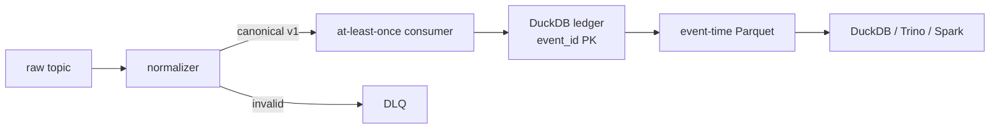

# D2C Event Data Platform

센서 로그 수집 실습에서 출발해, D2C 응모 승인 도메인의 데이터 정합성과 배포 안전성을
검증하는 Kafka 기반 Data Platform PoC입니다. 핵심 증거는 Kafka를 붙였다는 사실이 아니라
`승인 → 같은 DB 트랜잭션의 outbox → Kafka → 멱등 consumer` 경계와 이를 실제 release gate로
사용하는 운영 신호입니다.

이 README가 프로젝트의 실행·설계·운영 문서의 canonical source입니다. 상세 설계 메모와
일회성 검증 원본은 `docs/`에 로컬로 보관하지만 Git에는 포함하지 않습니다.

## 구현 내용과 검증 기록

승인 기록이 이벤트 전달과 소비자 저장까지 이어지는 경계는 다음 순서로 확인할 수 있습니다.

- 구현: [승인 API](app/app.py)는 승인과 outbox를 같은 DB 트랜잭션으로 기록합니다. [publisher](app/outbox_publisher.py)는 Kafka 확인 응답 뒤 발행 상태를 갱신하고, [consumer](services/d2c_event_consumer.py)는 `event_id`로 중복 저장을 막습니다. 전달 의미는 at-least-once이며, 재처리는 소비자 멱등성으로 처리합니다.
- 건수 대조: [2026-09-06 로컬 검증 기록](RUNBOOK.md#2026-09-06-로컬-검증-기록)의 최종 승인·outbox·consumer 저장 건수는 **9 / 9 / 9**입니다. 미발행 outbox는 0건, 저장된 고유 `event_id`는 9건, Kafka lag는 모든 partition에서 0으로 기록됐습니다.
- 실패와 복구: 같은 [RUNBOOK](RUNBOOK.md#2026-09-06-로컬-검증-기록)에 outbox 기록 실패 시 DB row 증가 0, PostgreSQL 장애 시 readiness 실패, Kafka 복구 후 backlog 해소를 남겼습니다.
- 실행 범위: [Compose 구성](docker-compose.yml)의 로컬 KRaft 단일 브로커·복제 계수 1에서 얻은 기록입니다. 별도 AWS 전송 경로의 결과와 구분하며, 다중 브로커 고가용성이나 실제 Kubernetes canary 배포를 검증한 수치로 사용하지 않습니다.

## 목표

- 파일 로그 수집과 Kafka raw topic 발행
- JSON/text 입력을 하나의 versioned data contract로 정규화
- 유효하지 않은 이벤트를 DLQ로 격리
- at-least-once 처리와 명시적 offset commit
- `event_id` 기반 중복 방지
- 로컬 DuckDB sink를 통한 분석 데이터 제공
- AWS Firehose → S3 bronze Parquet → Glue/Athena 전송 경로는 `aws` Compose profile로 분리
- Processor/Sink의 Prometheus metrics와 짧은 보존 정책으로 운영 상태·비용을 함께 확인
- local event-time Parquet lake와 AWS arrival-time bronze를 분리해 레이크화 경계를 검증
- 응모 승인과 transactional outbox를 같은 PostgreSQL 트랜잭션으로 기록
- 승인/outbox parity SLI, 5xx, p95 latency, outbox backlog를 Prometheus와 Argo canary gate에 연결
- validation-only failure drill에서 불일치·5xx·지연 시 stable 복귀 경로를 재현
- Terraform, CI, 데이터 품질 SQL, 장애·비용 runbook을 코드와 함께 관리

실행·장애 대응 절차는 [RUNBOOK.md](RUNBOOK.md), 프로젝트 개요와 설계 의사결정은 이
README를 canonical source로 사용합니다. 상세 메모와 일회성 검증 원본은 `docs/`에 로컬로
보관하며 Git에는 포함하지 않습니다.

## 아키텍처

```text
log_gen.py
    ├── sensor_json.log ──> Fluent Bit ──> factory.sensor.raw.json.v1 ──┐
    └── sensor_text.log ──> Fluent Bit ──> Logstash ──> factory.sensor.raw.text.v1 ─┤
                                                                                      │
                                                        stream-processor             │
                                          normalize / validate / DLQ                 │
                                             ├── factory.sensor.clean.v1 ──> stream-sink ──> data/sensor.duckdb
                                             └── factory.sensor.dlq.v1

                                                        factory.sensor.clean.v1
                                                                  │
                                                                  ▼
                                                     Vector (`aws` profile)
                                                                  │
                                                                  ▼
                                                   Kinesis Data Firehose
                                                                  │
                                                                  ▼
                              S3 bronze/ingest_year=YYYY/ingest_month=MM/ingest_day=DD/*.parquet
                                                                  │
                                                                  ▼
                                                         Glue / Athena
```

### 고정한 D2C release-confidence 흐름

```text
POST /api/apply
    │
    ▼
PostgreSQL transaction
    ├── d2c_applications(status=APPROVED)
    └── d2c_outbox_events(payload=d2c.application.approved.v1)
             │
             ▼
      at-least-once outbox publisher ──> Kafka
                                           │
                                           ▼
                              event_id 멱등 consumer
                                           │
                                           ▼
                                  DuckDB / lake boundary

Prometheus: parity gap + parity check + 5xx ratio + p95 + backlog + traffic
    │
    ▼
Argo Rollouts AnalysisRun ── pass: canary promotion / fail: stable 유지·abort
```

응모 승인 row와 outbox row는 하나의 commit으로 함께 보이거나 함께 rollback됩니다.
publisher는 Kafka ack 이후 `published_at`을 기록하므로 ack와 DB update 사이 crash는 중복
publish를 만들 수 있습니다. consumer의 `event_id` primary key와 `ON CONFLICT DO NOTHING`이
이를 흡수하는 at-least-once + idempotent sink 모델이며, exactly-once라고 과장하지 않습니다.

Kafka 내부 컨테이너는 `kafka:9092`, 호스트에서 접근할 때는 `localhost:29092`를 사용합니다. 로컬 브로커는 KRaft 단일 노드이며 replication factor는 1입니다. 이는 개발용 설정이고 고가용성 구성이 아닙니다.

## 실행

```bash
docker compose up -d --build
python3 log_gen.py
```

상태 확인:

```bash
docker compose ps
docker compose logs -f stream-processor stream-sink
```

운영 메트릭은 worker가 직접 노출합니다. 로컬 Prometheus까지 실행하려면 다음을 사용합니다.

```bash
curl http://localhost:9100/metrics  # processor: 처리 결과, lag, publish 실패
curl http://localhost:9101/metrics  # sink: stored/duplicate, 저장 실패
docker compose --profile observability up -d prometheus
open http://localhost:9090
```

Prometheus에는 lag, publish failure, DLQ 비율, sink write failure에 대한 기본 alert rule도
포함되어 있습니다. 이 로컬 profile은 Alertmanager를 붙이지 않았으므로 alert state는
Prometheus UI에서 확인하고, 운영 배포에서는 알림 채널과 on-call 정책을 연결합니다.

## D2C approval vertical slice

### 실행

```bash
docker compose --profile d2c up -d --build \
  kafka kafka-init postgres d2c-migrate d2c-api \
  d2c-outbox-publisher d2c-event-consumer

curl -fsS http://127.0.0.1:8080/readyz
curl -sS -X POST http://127.0.0.1:8080/api/apply \
  -H 'Content-Type: application/json' \
  -H 'Idempotency-Key: apply-local-0001' \
  -d '{"user_id":1001,"campaign_id":1}'

# 같은 idempotency key/aggregate는 duplicate 응답이며 두 번째 event를 만들지 않습니다.
curl -sS -X POST http://127.0.0.1:8080/api/apply \
  -H 'Content-Type: application/json' \
  -H 'Idempotency-Key: apply-local-0001' \
  -d '{"user_id":1001,"campaign_id":1}'
```

검증 포인트는 API metric, PostgreSQL outbox, Kafka topic, consumer 저장소를 한 번에 비교하는
것입니다.

```bash
docker compose exec -T postgres psql -U d2c -d d2c -c \
  'SELECT COUNT(*) AS applications,
          (SELECT COUNT(*) FROM d2c_outbox_events) AS outbox_events,
          (SELECT COUNT(*) FROM d2c_outbox_events WHERE published_at IS NOT NULL) AS published,
          (SELECT COUNT(*) FROM d2c_outbox_events WHERE published_at IS NULL) AS backlog;'

curl -fsS http://127.0.0.1:8080/metrics | rg \
  'd2c_(apply_requests_total|outbox_events_total|outbox_parity_gap|outbox_parity_check_success|db_readiness)'

docker compose exec -T d2c-event-consumer python -c \
  "import duckdb; c=duckdb.connect('/data/d2c_events.duckdb', read_only=True); print(c.execute('select count(*), count(distinct event_id) from d2c_application_events').fetchone())"

docker compose exec -T kafka /opt/kafka/bin/kafka-consumer-groups.sh \
  --bootstrap-server kafka:9092 \
  --describe --group d2c-application-event-consumer-v1
```

### Release gate와 Kubernetes

`k8s/d2c/base`에는 다음을 포함합니다.

- Argo Rollout: 10% → AnalysisRun → 50% → AnalysisRun 단계
- stable/canary Service와 NGINX Ingress traffic routing
- 승인 API의 5xx ratio, p95, DB readiness, outbox parity/조회 성공, canary traffic gate
- transactional outbox publisher, idempotent consumer, PreSync schema migration Job
- Prometheus Operator `ServiceMonitor`/`PrometheusRule`와 non-root/read-only container security context

```bash
kubectl kustomize k8s/d2c/base
kubectl kustomize k8s/d2c/overlays/validation
```

`validation` overlay는 `D2C_ENV=validation`, `ALLOW_FAILURE_DRILL=true`,
`D2C_OUTBOX_FAILURE_INJECTION=before_outbox_insert`를 넣은 실패 재현 전용입니다. 실제
cluster 적용에는 Argo Rollouts, NGINX Ingress, Prometheus Operator, PostgreSQL/Kafka,
`d2c-api-secret`, `d2c-api-tls`가 필요하며, 현재 repository에서 실제 cluster rollout을
실행했다고 주장하지 않습니다. 클러스터가 없는 환경에서는 Kustomize render와 local
Docker 수직 슬라이스를 검증 증거로 사용합니다.

API는 포트폴리오용 synthetic/internal boundary라 인증·인가를 구현하지 않았습니다. 실제
D2C 외부 트래픽에 노출하기 전에는 IdP/OIDC, rate limit, CSRF 또는 service-to-service
identity, TLS, secret manager, audit log를 edge와 workload identity에 추가해야 합니다.

장애 주입·복구 명령과 실제 측정표는 [RUNBOOK.md](RUNBOOK.md)에 정리했습니다.

### 실제 local validation (2026-09-06)

로컬 Docker 수직 슬라이스에서 승인 8건을 흘려 확인한 결과입니다. publisher 이미지에서
누락된 `kafka-python` 의존성을 먼저 발견·수정한 뒤 재실행했으며, 재시작 전후 outbox row의
재처리도 확인했습니다.

| 경계 | 실측값 | 판정 |
| --- | ---: | --- |
| PostgreSQL applications / outbox | 9 / 9 | parity invariant 유지 |
| published / unpublished outbox | 9 / 0 | publisher drain 완료 |
| consumer stored / unique event_id | 9 / 9 | 중복 없음 |
| Kafka consumer lag | 모든 partition 0 | 정상 수렴 |
| parity gap / query success | 0 / 1 | release gate 통과 |
| 승인 API 응답 sample | 11.6–19.1 ms | 정상 |
| outbox failure drill | HTTP 503, row 증가 0 | 원자성 보호 |
| PostgreSQL outage | readiness 503, gap/check 1/0 → 복구 | fail-closed |
| Kafka outage | 승인 201, backlog 1 → 복구 후 0 | durable retry |

Processor는 output publish가 성공한 뒤 처리한 Kafka record 하나의 offset만 명시적으로
commit합니다. 따라서 crash 후 중복은 허용하는 at-least-once 모델이며, sink의 `event_id`
primary key와 Athena deduplicated view가 재처리 중복을 흡수합니다.

토픽 확인:

```bash
docker compose exec kafka /opt/kafka/bin/kafka-topics.sh \
  --bootstrap-server kafka:9092 --list
```

정규화된 이벤트 확인:

```bash
docker compose exec kafka /opt/kafka/bin/kafka-console-consumer.sh \
  --bootstrap-server kafka:9092 \
  --topic factory.sensor.clean.v1 \
  --from-beginning
```

DLQ 확인:

```bash
docker compose exec kafka /opt/kafka/bin/kafka-console-consumer.sh \
  --bootstrap-server kafka:9092 \
  --topic factory.sensor.dlq.v1 \
  --from-beginning
```

DuckDB 조회:

```bash
docker compose stop stream-sink
docker compose run --rm --no-deps stream-sink python -c \
  "import duckdb; print(duckdb.connect('/data/sensor.duckdb').execute('select sensor_id, count(*) as events from sensor_events group by sensor_id order by sensor_id').fetchall())"
docker compose start stream-sink
```

DuckDB 파일은 단일 writer lock을 사용하므로 sink가 실행 중인 동안 별도 프로세스에서
같은 파일을 열 수 없습니다. 운영 환경에서는 전용 OLAP 저장소나 Iceberg/Parquet 테이블을
조회 대상으로 분리합니다.

## Local Parquet lakehouse PoC

`services.lake_sink.write_canonical_events`는 canonical event 목록과 `batch_id`를 받아
다음과 같은 event-time partition을 생성합니다.

```text
batch_id=<batch-id>/event_date=YYYY-MM-DD/*.parquet
```

내부 DuckDB ledger의 `event_id` primary key와 `exported_batches` marker를 사용해 다음
경계를 검증합니다.

- 같은 batch replay는 기존 export를 재사용하고 중복 row를 만들지 않습니다.
- 다른 batch에서 같은 `event_id`가 도착해도 PK로 저장을 멱등 처리합니다.
- Kafka source topic/partition/offset을 필수 lineage로 보존합니다.
- ledger commit과 Parquet rename 사이의 crash는 staging/final 파일 검증과 marker
  reconciliation으로 복구합니다.
- empty batch와 손상된 staging output을 별도 처리합니다.

이 local sink는 Kafka offset commit과 Parquet commit이 하나의 트랜잭션이 아닌
at-least-once 경계를 보여주는 교육용 구현입니다. 따라서 exactly-once라고 부르지 않으며,
작은 파일이 많아지는 운영 환경에서는 Spark Structured Streaming + Iceberg snapshot,
manifest, compaction으로 교체합니다.



Kafka UI는 <http://localhost:8081>에서 확인할 수 있습니다.

## 데이터 계약

정규화된 `factory.sensor.clean.v1` 이벤트는 다음 필드를 보장합니다.

```json
{
  "schema_version": "factory-sensor.v1",
  "event_id": "sha256(...)",
  "event_time": "2026-08-23T12:00:00Z",
  "ingested_at": "2026-08-23T12:00:01Z",
  "sensor_id": "AI-FACTORY-001",
  "temperature": 87.5,
  "humidity": 42.4,
  "status": "RUNNING",
  "source": {
    "topic": "factory.sensor.raw.json.v1",
    "partition": 0,
    "offset": 12
  }
}
```

현재 검증 규칙은 다음과 같습니다.

- `sensor_id`: 영숫자, `_`, `-` 조합
- `temperature`: `-40` 이상 `150` 이하
- `humidity`: `0` 이상 `100` 이하
- `status`: `RUNNING`, `IDLE`, `STOPPED`, `ERROR`
- timestamp 필수

검증 실패 이벤트는 원문과 실패 원인, Kafka source offset을 포함해 `factory.sensor.dlq.v1`로 보냅니다.

## 장애·중복 처리 설계

- Producer는 `acks=all`, retry, gzip compression을 사용합니다.
- Processor는 output publish가 성공한 뒤에만 input offset을 commit합니다.
- publish 후 commit 전에 장애가 나면 동일 이벤트가 재처리될 수 있으므로 at-least-once semantics입니다.
- Sink는 `event_id` primary key와 `ON CONFLICT DO NOTHING`으로 중복 저장을 방지합니다.
- Fluent Bit는 파일 offset DB와 filesystem buffer를 사용해 재시작 시 재전송·유실 위험을 줄입니다.

## 테스트

```bash
python3 -m unittest discover -s tests -v
```

GitHub Actions는 push/PR마다 root/app 의존성 설치, Python compile·unit test, D2C JSON
Schema 검증, Kustomize render, Terraform `fmt -check`·`validate`를 실행합니다. 별도
security workflow는 dependency audit, Bandit, CodeQL, Trivy, 이미지 SBOM을 수행합니다.
CI에서는 AWS `apply`나 `destroy`를 실행하지 않아 credential과 비용을 분리합니다.

DLQ 경로를 강제로 확인하려면 별도 터미널에서 다음처럼 invalid event 비율을 높여 실행합니다.

```bash
INVALID_RATE=1 INTERVAL_SECONDS=1 python3 log_gen.py
```

## AWS 전송 경로: S3 bronze Parquet lake

기본 실행은 AWS 자격증명을 요구하지 않습니다. AWS 실습을 할 때만 Terraform으로
S3/Firehose/Glue/CloudWatch/IAM을 만들고, Vector `aws` profile을 실행합니다. MSK, NAT
Gateway, ECS/EKS 같은 상시 실행 인프라는 이 레포에서 만들지 않습니다.

### 1. AWS 계정과 자격증명 확인

장기 access key를 repository나 `.env`에 저장하지 말고, AWS CLI profile/SSO 또는 짧은
수명의 STS 환경변수를 사용합니다.

```bash
aws sso login --profile develope-test
eval "$(aws configure export-credentials --profile develope-test --format env)"
export AWS_REGION=ap-northeast-2
export AWS_DEFAULT_REGION=ap-northeast-2
aws sts get-caller-identity
```

SSO profile을 사용할 때 `export-credentials`를 실행한 같은 shell에서 Terraform과
Docker Compose를 실행해야 합니다. 이 방식은 session token을 포함한 단기 credential만
프로세스 환경에 주입하며 repository나 `.env`에 저장하지 않습니다. 만료되면 SSO login을
다시 실행합니다.

### 2. Terraform plan/apply

```bash
cd infra/terraform
cp terraform.tfvars.example terraform.tfvars
terraform init
terraform plan -out=tfplan
terraform apply tfplan

export FIREHOSE_STREAM_NAME="$(terraform output -raw firehose_name)"
export AWS_REGION="$(terraform output -raw aws_region)"
cd ../..
```

`terraform apply`는 실제 AWS 리소스를 생성합니다. 로컬 검증 단계에서는
`terraform init -backend=false`와 `terraform validate`까지만 실행해도 됩니다.

이 모듈은 S3, DirectPut Firehose, Glue Catalog, CloudWatch Log Group, Firehose 전용
least-privilege IAM role/policy만 만들며 MSK, NAT Gateway, ECS/EKS 같은 상시 실행
컴퓨트를 만들지 않습니다. Parquet conversion을 켜면 Firehose buffering 최소 크기는
64 MiB이고 기본 delivery interval은 60초입니다.

### 3. Vector와 단일 producer 실행

```bash
# 1단계의 SSO credential export와 같은 shell에서 실행
docker compose up -d --build
docker compose --profile aws up -d vector
docker compose --profile observability up -d prometheus
LOG_FORMAT=json INVALID_RATE=0.05 INTERVAL_SECONDS=2 python3 log_gen.py
```

운영 상태는 worker endpoint와 Prometheus에서 확인합니다.

```bash
curl http://localhost:9100/metrics
curl http://localhost:9101/metrics
open http://localhost:9090
```

`LOG_FORMAT=json`은 같은 이벤트를 JSON/text 두 경로로 동시에 보내서 생기는 의도적
중복을 피합니다. 중복 경로 자체를 검증하려면 기본값 `both`로 실행하고 Athena의
`sql/athena_validation.sql`과 `sensor_events_deduplicated` view를 사용합니다.

Parquet 변환은 Firehose가 버퍼를 채우거나 기본 60초 interval에 도달한 뒤 S3에 전달합니다.
실제 landing 확인은 다음처럼 합니다.

```bash
cd infra/terraform
aws s3 ls "s3://$(terraform output -raw bucket_name)/bronze/" --recursive
```

Glue database/table 이름은 Terraform output에서 확인하고, Athena query editor에서 해당
database를 선택한 뒤 `sql/athena_validation.sql`을 실행합니다. 날짜 partition predicate를
넣지 않은 대형 조회는 비용과 성능을 악화시키므로 운영 쿼리에서는 반드시
`ingest_year/ingest_month/ingest_day` 조건을 사용합니다. 이 cloud partition은 Firehose
도착 시각 기준이며, event-time 분석이 필요하면 `event_time` 범위를 별도로 조건에
추가합니다.

### 4. 실습 종료와 삭제

```bash
cd ../..
docker compose --profile aws --profile observability down --remove-orphans

cd infra/terraform
BUCKET="$(terraform output -raw bucket_name)"
# Versioning이 켜져 있으므로 current/non-current version과 delete marker를 모두 삭제합니다.
DELETE_PAYLOAD="$(aws s3api list-object-versions --bucket "$BUCKET" --output json \
  | jq -c '{Objects:([.Versions[]?, .DeleteMarkers[]?] | map({Key:.Key,VersionId:.VersionId})), Quiet:true}')"
if [ "$(printf '%s' "$DELETE_PAYLOAD" | jq '.Objects | length')" -gt 0 ]; then
  aws s3api delete-objects --bucket "$BUCKET" --delete "$DELETE_PAYLOAD"
fi
terraform destroy
```

S3 bucket의 `force_destroy` 기본값은 `false`입니다. 데이터가 남은 상태에서 Terraform이
실수로 bucket을 지우지 않도록 한 설정입니다. `list-object-versions` 결과가 `0`인지 확인한
뒤 destroy를 실행합니다. `force_destroy=true`는 일회성 실습에서 삭제를 명시적으로
감수할 때만 사용합니다.

### 예상 비용과 비용 통제

짧은 포트폴리오 실습에서는 상시 Kafka 클러스터를 만들지 않는 것이 가장 큰 절감 포인트입니다.
정확한 금액은 리전, 데이터량, 쿼리 횟수, 계정 Free Tier에 따라 달라지지만 기본 설정은
7일 lifecycle과 7일 CloudWatch log retention으로 남은 비용을 제한합니다.

- Firehose: 시간당 클러스터 비용 없이 수집 데이터량 기준 과금되며, Direct PUT은 5 KB 단위로 반올림됩니다. JSON→Parquet 변환도 별도 데이터 처리량 과금 대상입니다.
- S3: 저장량·request·data transfer 기준 과금이며 `bronze/`, `errors/` 객체를 7일 후 삭제합니다.
- KMS: customer-managed key와 암호화 API 요청에 비용이 발생할 수 있습니다. 일회성 포트폴리오 실습에서는 검증 후 `terraform destroy`까지 수행해 키와 잔존 비용을 정리합니다.
- Athena: 스캔 데이터 기준 과금이므로 partition filter를 사용합니다. 공식 가격 기준 쿼리당 10 MB 최소 스캔이 적용됩니다.
- Glue Catalog/CloudWatch: 작은 metadata와 짧은 로그 보존으로 실습 규모에서는 보통 주요 비용원이 아닙니다. 로그량·custom metric 사용량은 계정별로 확인합니다.
- MSK: 이 PoC에는 포함하지 않았습니다. 상시 broker/serverless 비용이 발생할 수 있어, Kafka 자체를 AWS에 띄우는 단계는 별도 실습으로 분리합니다.

공식 가격표: [Firehose](https://aws.amazon.com/firehose/pricing/),
[S3](https://aws.amazon.com/s3/pricing/), [Athena](https://aws.amazon.com/athena/pricing/),
[Glue](https://aws.amazon.com/glue/pricing/), [CloudWatch](https://aws.amazon.com/cloudwatch/pricing/).

### 실제 AWS POC 검증 기록 (2026-09-03)

이번 실행은 `ap-northeast-2`에서 임시 리소스를 생성하고, 검증 후 전부 teardown한
일회성 측정입니다. 계정 ID·bucket 이름·query execution ID는 공개 문서에 남기지
않았습니다.

| 경계 | 실측값 | 판정 |
| --- | ---: | --- |
| JSON raw 입력 | 35 records | 정상 |
| Processor clean / DLQ | 29 / 6 records | 범위 위반 6건 격리 |
| Kafka processor/sink/vector lag | 0 | 정상 |
| DuckDB sink 저장 | 29 records | 정상 |
| Firehose IncomingRecords | 29 | 정상 |
| Firehose IncomingBytes | 17,582 bytes | 정상 |
| Firehose SucceedConversion.Records | 29 | 정상 |
| Firehose FailedConversion.Records | 0 | 정상 |
| Firehose DeliveryToS3.Records | 29 | 정상 |
| Firehose DeliveryToS3.Success | 1 | 정상 |
| Firehose ThrottledRecords | 0 | 정상 |
| Firehose DataFreshness | 65 seconds | 60초 buffering과 일치 |
| S3 bronze output | 1 Parquet object / 5,710 bytes | 정상 |
| Athena landed rows / unique event_id | 29 / 29 | 중복 없음 |
| Athena invalid temperature/humidity/status | 0 / 0 / 0 | 정상 |
| Athena DataScannedInBytes | 2,687 bytes | partition predicate 적용 |

Parquet은 `bronze/ingest_year=2026/ingest_month=09/ingest_day=03/` 아래에 생성됐고,
`source` nested struct, `vector_ingest_at`, `pipeline` metadata가 유지됐습니다. Athena
쿼리는 약 494 ms engine time, 672 ms total time으로 성공했습니다. Prometheus scrape
target은 processor/sink 모두 `up`이었고, DLQ rate 약 10.35% alert는 `for: 5m` 조건에
따라 `pending` 상태가 됐습니다.

#### 검증 중 트러블슈팅

1. `default` profile은 `InvalidClientTokenId`가 발생했습니다. 폐기된 access key를
   재사용하지 않고 SSO login 후 단기 credential을 `export-credentials`로 같은 shell과
   Docker에 주입해 해결했습니다.
2. 첫 CloudWatch 조회는 metric publication 지연으로 빈 datapoint를 반환했습니다.
   `list-metrics`로 `DeliveryStreamName` dimension과 metric 이름을 확인한 뒤 재조회해
   incoming/conversion/delivery 29건을 확인했습니다.
3. 이벤트 생성 후 카운트 shell에서 zsh 예약 변수 `status`를 사용해 후처리만 실패했습니다.
   데이터에는 영향이 없었고 변수명을 `rc`로 바꿔 재확인했습니다.
4. 로컬 Kafka 재기동 직후 `NotCoordinatorError`가 일시적으로 발생했습니다. consumer가
   coordinator를 재탐색하고 group에 재가입한 뒤 lag 0으로 수렴했습니다.

검증 후 Docker/Prometheus를 종료하고, S3 versioned object와 Athena 결과를 삭제한 뒤
Terraform destroy를 실행했습니다. 따라서 이 검증으로 남은 상시 AWS 리소스나 지속 비용은
없습니다.

## 현재 완료 범위와 다음 단계

현재 구현·검증된 범위는 승인 API의 transactional outbox, 공유 D2C event contract/JSON
Schema, at-least-once publisher, `event_id` 멱등 consumer, DB-truth parity SLI, 5xx/p95/
backlog metrics, Argo canary manifest, failure drill, local event-time Parquet quality gate,
AWS Firehose→S3 bronze Parquet POC, CI/security workflow입니다.

운영 수준으로 더 확장할 때의 순서는 다음과 같습니다.

1. EKS에서 실제 Argo Rollouts + NGINX + Prometheus Operator를 연결하고 AnalysisRun abort와 stable traffic을 실측
2. AWS workload identity, Secrets Manager, Kafka TLS/SASL/ACL과 외부 인증·인가 추가
3. DuckDB/local Parquet consumer sink를 Spark Structured Streaming + Iceberg snapshot/compaction으로 교체
4. Airflow/dbt 또는 데이터 품질 오케스트레이터로 freshness, null/range/duplicate 검사와 backfill 자동화
5. MSK 또는 다중 broker/RF3 환경에서 rebalance, partition scaling, retention/비용을 별도 실습
